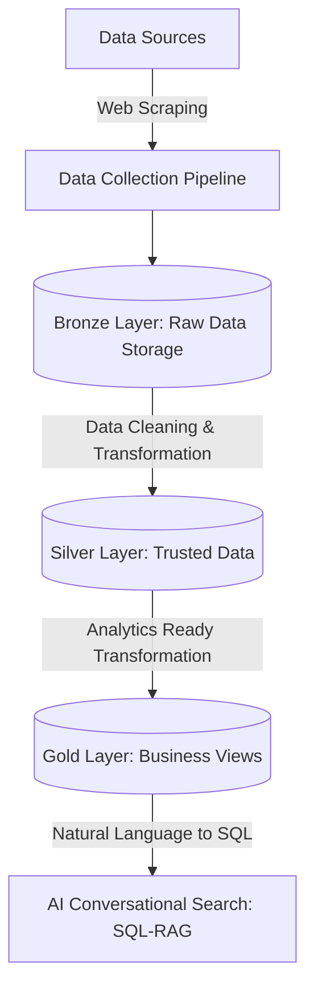

Dưới đây là toàn bộ nội dung đã được tối ưu hóa, làm liền mạch cấu trúc Markdown, chuẩn hóa định dạng code block, kẻ bảng và sơ đồ dòng chảy dữ liệu (`flowchart`) bằng cú pháp `mermaid`. Bạn chỉ cần sao chép toàn bộ nội dung trong ô mã dưới đây và dán thẳng vào file `.md` của mình:

```markdown
# 🇻🇳 Vietnam Hotel Data Engineering Platform

## 📑 Overview
This is a personal **Data Engineering project** that builds an end-to-end data pipeline for collecting, processing, and analyzing hotel information in Vietnam.

The project aims to solve the problem of fragmented hotel data sources in the tourism industry by creating an automated data platform that enables structured storage, scalable processing, and intelligent hotel discovery.

The system combines modern Data Engineering practices with AI-powered conversational search to help users explore hotel information naturally.

---

## 💼 Business Problem
Vietnam's tourism industry has experienced significant growth, resulting in a large amount of hotel information across different platforms. 

However, existing hotel data is:
* **Distributed** across multiple sources.
* **Difficult** to aggregate and analyze comprehensively.
* **Time-consuming** for users to manually filter based on multiple complex criteria.
* **Limited** in supporting personalized or natural search experiences.

This project addresses these challenges by building an automated data pipeline and an AI-assisted hotel search platform.

---

## 🛠️ Solution Overview

Dưới đây là mô hình luồng dữ liệu tổng quan của hệ thống từ lúc thu thập đến khi phục vụ người dùng cuối thông qua AI:



---

## 🏗️ Data Architecture

### Medallion Architecture

Dự án áp dụng mô hình kiến trúc dữ liệu phân lớp **Medallion Architecture** nhằm đảm bảo tính toàn vẹn và chất lượng dữ liệu:

* **Bronze Layer:** * Stores raw data collected directly from external sources.
* Preserves original data for complete traceability.
* Supports data lineage tracking and comprehensive pipeline reprocessing.


* **Silver Layer:**
* Cleans, de-duplicates, and standardizes raw datasets.
* Handles missing values, performs schema normalization, and formats data types.


* **Gold Layer:**
* Provides highly optimized, business-ready datasets.
* Structured specifically for complex analytics, BI tools, and user-facing AI applications.


---

## 💻 Technology Stack

### 1. Data Engineering & Storage

* **Python:** Ngôn ngữ lập trình chính cho toàn bộ pipeline.
* **Apache Airflow:** Điều phối và lập lịch (Orchestration) luồng chạy ETL tự động.
* **AWS S3:** Hồ dữ liệu trung tâm (Data Lake storage) lưu trữ các tầng Medallion.
* **AWS Glue:** Công cụ Serverless ETL thực hiện việc chuyển đổi và quản lý schema catalog.
* **Amazon Athena:** Động cơ truy vấn Serverless SQL trực tiếp trên S3 data lake.
* **Apache Parquet:** Định dạng lưu trữ dạng cột (Columnar format) giúp tối ưu hiệu năng và chi phí truy vấn.

### 2. Data Processing

* **Pandas:** Xử lý và biến đổi cấu trúc dữ liệu thô ở quy mô vừa nhỏ.
* **SQL:** Xây dựng các logic phân tích dữ liệu và định nghĩa cấu trúc bảng ở tầng Silver/Gold.
* **ETL Pipeline Development:** Tư duy thiết kế luồng trích xuất, biến đổi và tải dữ liệu chuẩn doanh nghiệp.

### 3. AI Integration

* **Claude API:** Mô hình ngôn ngữ lớn (LLM) đứng sau xử lý ngôn ngữ tự nhiên.
* **SQL-RAG Architecture:** Kiến trúc thế hệ mới kết hợp Retrieval-Augmented Generation với dữ liệu có cấu trúc.
* **Natural Language to SQL Generation:** Chuyển đổi trực tiếp câu hỏi tiếng Việt của người dùng thành câu lệnh SQL thực thi trực tiếp trên tầng Gold.

---

## 🎯 Key Design Decisions

### 1. Medallion Architecture Application

A layered data architecture is applied to drastically improve:

* Data quality management through explicit validation gates.
* Data lineage tracking for auditability.
* Scalability as data volume grows.
* Overall pipeline maintainability and error isolation.

### 2. Serverless Data Platform Benefits

The project relies on AWS Glue, Athena, and S3 Parquet storage. This strategic approach minimizes infrastructure management, scales automatically, and reduces monthly operational cost to near-zero for small-to-medium datasets.

### 3. SQL-RAG Instead of Vector Search

Because hotel information (prices, ratings, locations, amenities) is highly structured, SQL-based retrieval is chosen instead of pure vector search.

**Advantages:**

* More accurate filtering for complex multi-condition queries.
* Better handling of explicit structured attributes (e.g., exact price range, exact star count).
* Transparent, debuggable query logic.

> **Example:** > *"Find 5-star hotels in Da Nang near the beach with rating above 4.5"*
> can be instantly converted into precise SQL WHERE clauses rather than relying on semantic similarity approximation.

### 4. AI Conversational Interface

Claude API is deeply integrated into the backend application to:

* Understand Vietnamese natural language queries perfectly.
* Generate safe, syntax-correct SQL queries on the fly.
* Maintain multi-turn conversation context for a smooth chatbot experience.
* Provide interactive, data-driven hotel discovery experiences for users.

---

## 🎁 Project Contributions

Dự án này mang lại các giá trị cốt lõi bao gồm:

* An automated hotel data collection pipeline.
* Robust daily data update capabilities (Data Freshness).
* Structured, clean, and analytical Vietnam hotel dataset.
* Scalable cloud-based serverless data architecture.
* Innovative natural language hotel search experience.
* Highly expandable architecture ready for additional data sources and regions.

---

## 📂 Project Structure

Dưới đây là cấu trúc thư mục của dự án:

```text
booking_de_project/
├── airflow/
│   └── dags/
│       └── booking_scraper_dag.py
├── data/
│   ├── hotels_vietnam_all.csv
│   └── hotels_vietnam_all.jsonl
├── scraper_final.py
├── start_airflow.sh
├── stop_airflow.sh
├── README.md
└── requirements.txt

```

---

## 🚀 Future Improvements

* Add real-time data ingestion using streaming architectures (e.g., Apache Kafka / AWS Kinesis).
* Implement rigorous data quality monitoring and alerting (e.g., Great Expectations).
* Add automated CI/CD testing for ETL pipelines.
* Extend scraping and integration coverage to multiple diverse tourism and flight platforms.
* Deploy the final AI search interface as a production-grade web application (Streamlit / Next.js).

---

## 👤 Author

**Personal Data Engineering Project** Built with passion to practice and demonstrate proficiency in:

* End-to-End Data Pipeline Development
* Cloud Data Platform Architecture (AWS Serverless)
* Enterprise ETL Design & Optimization
* AI-powered Data Applications (SQL-RAG)

```

```